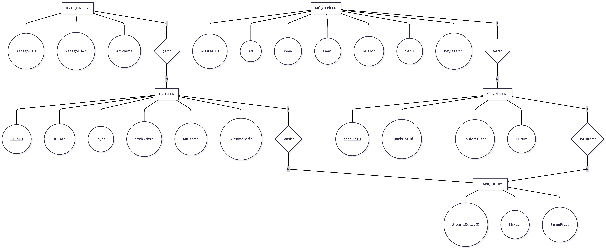

# Mobilya Otomasyonu

**Kocaeli Üniversitesi** — Bilişim Sistemleri Mühendisliği
**Ders:** TBL331 Veritabanı Yönetim Sistemleri
**Dönem Projesi**

**Hazırlayanlar:** Onur TOPBAŞ • Ali Hamza TEKİNBAŞ

---

## İçindekiler
1. [Problem Tanımı](#1-problem-tanımı)
2. [Yapılan Araştırmalar](#2-yapılan-araştırmalar)
3. [Kullanılan Teknolojiler](#3-kullanılan-teknolojiler)
4. [Genel Yapı](#4-genel-yapı)
5. [ER Diyagramı](#5-er-diyagramı)
6. [Yazılım Mimarisi](#6-yazılım-mimarisi)
7. [Akış Şeması](#7-akış-şeması)
8. [Veritabanı Nesneleri](#8-veritabanı-nesneleri)
9. [Kurulum ve Çalıştırma](#9-kurulum-ve-çalıştırma)
10. [İş Bölümü ve Çalışma Yöntemimiz](#10-iş-bölümü-ve-çalışma-yöntemimiz)
11. [Ekran Görüntüleri](#11-ekran-görüntüleri)
12. [Referanslar](#12-referanslar)

---

## 1. Problem Tanımı

Bu projede, bir mobilya mağazasının ürün, müşteri ve sipariş süreçlerini elektronik ortamda yönetebileceği bir veritabanı ve buna bağlı bir masaüstü uygulaması geliştirmeyi amaçladık. Manuel takip ile yürütülen bir mağaza için stok takibi, sipariş durumu ve müşteri geçmişi gibi süreçler hata yapmaya açıktır; ayrıca kategori bazlı analiz veya stok uyarısı gibi iş kararlarını destekleyici raporlar üretmek de bu yöntemle güçtür.

Geliştirdiğimiz sistemde kategoriler altında ürünler tutulmakta, müşteriler bu ürünler için sipariş açabilmekte, sipariş oluşturulduğunda stok ve toplam tutar gibi alanlar veritabanı katmanında otomatik olarak güncellenmektedir. Böylece iş mantığı uygulama katmanına bırakılmamakta, veritabanı seviyesinde tutarlılık sağlanmaktadır.

---

## 2. Yapılan Araştırmalar

Projeye başlarken hem ders yönergesindeki teknik gereksinimleri hem de çapraz platform çalışma ortamımızı dikkate alarak şu konularda ön araştırma yaptık:

- **PostgreSQL'de Trigger yapısı:** PostgreSQL'de trigger'ların SQL Server'dan farklı olarak iki parçalı (önce `CREATE FUNCTION ... RETURNS TRIGGER`, ardından `CREATE TRIGGER`) yazıldığını öğrendik ve örnekledik.
- **`CREATE FUNCTION` ve `CREATE PROCEDURE` farkı:** Değer döndüren işler için fonksiyon, yalnızca işlem yapan (`CALL` ile çağrılan) işler için procedure kullanılması gerektiğini ve `RETURNS TABLE` yaklaşımının raporlamada pratik olduğunu inceledik.
- **Python — PostgreSQL bağlantısı:** `psycopg2-binary` kütüphanesinin kurulumu ve bağlantı havuzu yönetimi hakkında araştırma yaptık.
- **Tkinter ile Treeview kullanımı:** Liste/tablo görüntüleme için Tkinter'ın `ttk.Treeview` bileşenini ve sütun konfigürasyonunu inceledik.
- **Normalizasyon (5N) ilkeleri:** Tablolarımızın her birinin tek bir konuyu modellemesi ve tekrar eden verinin bulunmaması için 5N kurallarını gözden geçirdik.

---

## 3. Kullanılan Teknolojiler

Yönergede dil/teknoloji kısıtı bulunmadığı için, ekibimizdeki her iki üyenin de aynı ortamda sorunsuz çalışabileceği bir kombinasyon belirledik. Grup üyemiz Onur macOS, Ali ise Windows kullandığından çapraz platform çalışan araçları tercih ettik.

| Katman | Teknoloji | Tercih Nedenimiz |
| Veritabanı | PostgreSQL | Trigger, View, Index ve Procedure için güçlü destek; macOS ve Windows'ta birebir çalışır. |
| VTYS Aracı | DBeaver Community | Ücretsiz, görsel arayüzlü, SSMS'in çapraz platform muadili. |
| Uygulama Dili | Python 3 + Tkinter | Tkinter Python ile birlikte gelir, ek kurulum gerektirmez; Türkçe kaynak boldur. |
| Kütüphane | `psycopg2-binary` | PostgreSQL için en yaygın ve sağlam Python sürücüsü. |
| Editör | VS Code | Hafif, çapraz platform, Python eklentisi ile zengin destek. |
| Sürüm Kontrol | Git + GitHub | İş bölümünün ve katkıların kanıtlanabilir olması için. |
| Diyagram | dbdiagram.io / draw.io | Tarayıcı tabanlı; tek bir kişide kalmıyor. |

Klasik SQL Server + SSMS + C# WinForms kombinasyonunu değerlendirdik ancak SSMS'in yalnızca Windows'ta bulunması ve Visual Studio for Mac'in Microsoft tarafından emekliye ayrılmış olması nedeniyle ekibimizin macOS tarafında sorun yaşayacağını gördük. PostgreSQL + Python tercihimiz bu uyumsuzluğu ortadan kaldırmaktadır.

---

## 4. Genel Yapı

Projemizin dosya yapısı aşağıdaki gibi tasarlanmıştır:

```
mobilyaotomasyon/
├── sql/
│   ├── 01_tablolar.sql
│   ├── 02_veriler.sql
│   ├── 03_view_index.sql
│   ├── 04_triggerlar.sql
│   └── 05_fonksiyonlar.sql
├── uygulama/
│   └── (Python kaynak dosyaları)
├── docs/
│   ├── er_diyagrami.png
│   ├── akis_semasi.png
│   └── ekran_goruntuleri/
└── README.md
```

**Veritabanı şemamız 5 tablodan oluşmaktadır:** Kategoriler, Urunler, Musteriler, Siparisler, SiparisDetay. Bu tablolar arasında 4 adet 1-N ilişki tanımlanmıştır:

- Kategori → Ürün
- Müşteri → Sipariş
- Sipariş → SiparişDetay
- Ürün → SiparişDetay

---

## 5. ER Diyagramı

Tabloların ve ilişkilerin görsel temsili `docs/er_diyagrami.png` dosyasında yer almaktadır. Diyagramı dbdiagram.io üzerinde DBML söz dizimiyle oluşturduk.



---

## 6. Yazılım Mimarisi

Uygulamamız üç katmanlı bir mimari ile geliştirilmiştir:

- **Sunum Katmanı:** Tkinter tabanlı masaüstü arayüzü. Kullanıcının kategori, ürün, müşteri ve sipariş işlemlerini gerçekleştirdiği ekranları içerir.
- **Veri Erişim Katmanı:** `psycopg2` üzerinden PostgreSQL ile iletişim kuran Python modülleri. Sorgular parametre bağlama (`%s`) ile güvenli biçimde gönderilir.
- **Veritabanı Katmanı:** PostgreSQL üzerinde tanımlı tablolar, view'lar, index'ler, trigger'lar ve fonksiyonlar. İş mantığının önemli bir kısmı bu katmandadır.

Mimarinin görsel temsili `docs/yazilim_mimarisi.png` dosyasında bulunmaktadır.

---

## 7. Akış Şeması

Tipik bir sipariş işlemi şu adımlardan oluşmaktadır: müşteri seçimi → sipariş oluşturma → ürün ekleme → trigger üzerinden stok düşürme → trigger üzerinden toplam tutar güncellemesi → sipariş kaydı. Detaylı akış şemasını `docs/akis_semasi.png` dosyasında sunduk.

---

## 8. Veritabanı Nesneleri

Yönergenin öngördüğü tüm zorunlu nesneleri birden fazla örnekle karşılayacak şekilde tasarladık.

### Tablolar (5 adet)
`KATEGORILER`, `URUNLER`, `MUSTERILER`, `SIPARISLER`, `SIPARISDETAY`

### Kısıtlayıcılar
- **Primary Key:** Tüm tablolarda `SERIAL` tipinde otomatik artan birincil anahtarlar
- **Foreign Key:** 4 ilişki
- **Unique:** `KategoriAdi`, `Email`
- **Check:** `Fiyat > 0`, `StokAdedi >= 0`, `Miktar > 0`, `BirimFiyat > 0`, sipariş durumu sınırlı küme
- **Default:** Tarih alanları için `CURRENT_TIMESTAMP`, stok için 0, durum için "Hazırlanıyor"

#### Kısıtlayıcı Detayları ve Gerekçeleri

| Kısıtlayıcı | Nerede Kullanıldı | Neden Gerekli |
|---|---|---|
| `PRIMARY KEY` | Tüm tablolarda `SERIAL` ile | Her satırı benzersiz tanımlar; Foreign Key ilişkileri için zorunludur |
| `FOREIGN KEY` | `SIPARISLER.MusteriID → MUSTERILER` | Sistemde kayıtlı olmayan bir müşteriye sipariş açılmasını engeller |
| `FOREIGN KEY` | `SIPARISDETAY.SiparisID → SIPARISLER` | Var olmayan bir siparişe detay eklenmesini engeller |
| `FOREIGN KEY` | `SIPARISDETAY.UrunID → URUNLER` | Sistemde olmayan bir ürünün siparişe eklenmesini engeller |
| `UNIQUE` | `MUSTERILER.Email` | Aynı e-posta adresiyle iki farklı müşteri kaydı oluşmasını önler |
| `UNIQUE` | `KATEGORILER.KategoriAdi` | Aynı kategorinin iki kez girilmesini önler |
| `CHECK Fiyat > 0` | `URUNLER` | Sıfır veya negatif fiyatlı ürün kaydedilmesini önler |
| `CHECK StokAdedi >= 0` | `URUNLER` | Stok miktarının negatife düşmesini engeller |
| `CHECK Miktar > 0` | `SIPARISDETAY` | Sıfır adet sipariş verilmesini önler |
| `CHECK BirimFiyat > 0` | `SIPARISDETAY` | Geçersiz birim fiyat kaydını önler |
| `CHECK Durum IN (...)` | `SIPARISLER` | Sipariş durumunun yalnızca tanımlı değerler almasını sağlar |
| `DEFAULT CURRENT_TIMESTAMP` | Tarih alanları | Tarih bilgisinin elle girilmek zorunda kalınmadan otomatik atanmasını sağlar |
| `DEFAULT 'Hazırlanıyor'` | `SIPARISLER.Durum` | Yeni açılan her sipariş otomatik olarak bu durumda başlar |
| `DEFAULT 0` | `URUNLER.StokAdedi` | Yeni eklenen ürün stok alanı boş kalmadan sıfırdan başlar |

### View'lar
- `vw_urun_katalog` — Ürün ve kategori bilgilerinin birleşik görünümü
- `vw_siparis_ozet` — Sipariş, müşteri ve toplam tutar özeti
- `vw_stok_durumu` — Stok seviyesi azalan ürünlerin listesi

### Index'ler
- `ix_urunler_kategori` — Kategoriye göre ürün listelemelerini hızlandırır
- `ix_siparisler_musteri` — Müşteri bazlı sipariş geçmişi sorgularını hızlandırır
- `ix_siparisdetay_siparis` — Sipariş detayı çekme işlemlerini hızlandırır

### Trigger'lar
- `trg_stok_dus` — Sipariş detayı eklendiğinde ilgili üründen stok düşer
- `trg_stok_kontrol` — Yetersiz stok durumunda eklemeyi engeller
- `trg_siparis_toplam_guncelle` — Toplam tutarı otomatik olarak yeniden hesaplar

### Fonksiyonlar / Procedure'lar
- `fn_yeni_siparis_olustur` — Verilen müşteri için yeni bir sipariş açar
- `fn_siparise_urun_ekle` — Bir siparişe ürün ekler, stok kontrolünü tetikler
- `fn_musteri_siparis_gecmisi` — Bir müşterinin tüm siparişlerini döndürür
- `fn_kategori_bazli_satis` — Kategori bazlı satış raporu üretir

---

## 9. Kurulum ve Çalıştırma

### Gereksinimler
- PostgreSQL 14 veya üzeri
- Python 3.10 veya üzeri
- `psycopg2-binary` kütüphanesi

### Kurulum Adımları

```bash
# 1. Repoyu klonlayın
git clone https://github.com/OnurTOPBAS/Mobilya_otomasyon.git
cd Mobilya_otomasyon

# 2. PostgreSQL'de "mobilyadb" adında bir veritabanı oluşturun
#    (DBeaver veya psql üzerinden)

# 3. SQL betiklerini sırasıyla çalıştırın
psql -d mobilyadb -f sql/01_tablolar.sql
psql -d mobilyadb -f sql/02_veriler.sql
psql -d mobilyadb -f sql/03_view_index.sql
psql -d mobilyadb -f sql/04_triggerlar.sql
psql -d mobilyadb -f sql/05_fonksiyonlar.sql

# 4. Python bağımlılığını kurun
pip3 install psycopg2-binary

# 5. Uygulamayı çalıştırın
python3 uygulama/main.py
```

---

## 10. İş Bölümü ve Çalışma Yöntemimiz

Projeye başlarken iş bölümünü herhangi bir uzmanlık alanına göre değil, **her iki üyemizin de projenin tamamına hakim olabilmesi** ilkesine göre yapmaya karar verdik. Bu kararın iki temel gerekçesi vardır:

1. **Sunum gereksinimi:** Yönergede de belirtildiği üzere sunumda her iki üyeye de kodun herhangi bir satırı sorulabilmektedir. "Bu kısmı arkadaşım yazdı" şeklinde bir savunma kabul edilmemektedir. Dolayısıyla her iki üyenin de SQL nesnelerine, Python arayüzüne ve dokümantasyona temasının olması gerekmektedir.
2. **Öğrenme amacı:** Dersin temel amacı veritabanı yönetim sistemlerini öğrenmek olduğundan, birinin yalnızca arayüz, diğerinin yalnızca SQL yazması her iki üyenin de eksik kalmasına neden olurdu.

Bu doğrultuda görevleri birlikte oturup adil biçimde böldük; her gün sonunda 15 dakikalık bir karşılıklı anlatım oturumu yaparak diğerinin yazdığı kısmı da öğrenmeyi planladık. GitHub commit geçmişi katkılarımızın kanıtı niteliğindedir.

### Günlere Göre İş Bölümü

| Gün | Onur Topbaş | Ali [Soyad] |
| --- | --- | --- |
| 1 | Repo kurulumu, README iskeleti, klasör yapısı | DBeaver ile boş `mobilyadb` veritabanı, ER diyagramı denemesi |
| 2 | Sütun ve veri tipi netleştirmesi (PostgreSQL) | Kısıtlayıcı listesi ve gerekçeleri |
| 3 | Kategoriler, Urunler, Musteriler tabloları | Siparisler, SiparisDetay tabloları + Foreign Key tanımları |
| 4 | İlk üç tabloya en az 10'ar test verisi | Sipariş tablolarına test verisi + kısıt testleri |
| 5 | 2 view + 1 index | 1 view + 2 index |
| 6 | `trg_stok_dus`, `trg_stok_kontrol` | `trg_siparis_toplam_guncelle` + log trigger |
| 7 | `fn_yeni_siparis_olustur`, `fn_musteri_siparis_gecmisi` | `fn_siparise_urun_ekle`, `fn_kategori_bazli_satis` |
| 8 | Bağlantı modülü, ana menü, kategori ekranı | Ürün yönetim ekranı (Treeview ile) |
| 9 | Müşteri ekranı + sipariş oluşturma ekranı | Siparişe ürün ekleme + rapor ekranı |
| 10 | README metin içeriğinin tamamlanması | Akış şeması, mimari diyagramı, ekran görüntüleri |

---

## 11. Ekran Görüntüleri

Uygulamanın çalışan ekran görüntüleri `docs/ekran_goruntuleri/` klasöründe yer almaktadır.

---

## 12. Referanslar

- PostgreSQL Resmi Dokümantasyonu — https://www.postgresql.org/docs/
- psycopg2 Dokümantasyonu — https://www.psycopg.org/docs/
- Tkinter Dokümantasyonu — https://docs.python.org/3/library/tkinter.html
- DBeaver Belgeleri — https://dbeaver.io/docs/
- dbdiagram.io DBML Söz Dizimi — https://dbml.dbdiagram.io/docs/

Geliştirme sürecinde dış kaynaklardan yararlandığımız kod parçaları, ilgili kaynak dosyalarda yorum satırı olarak kaynağıyla birlikte belirtilmiştir.
